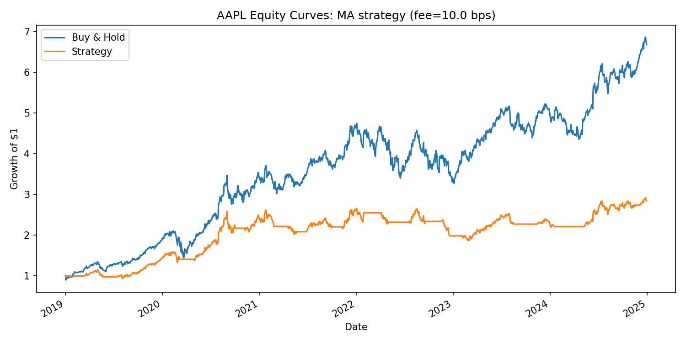
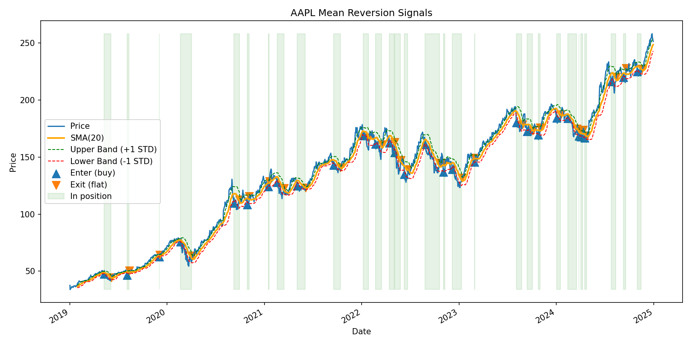

# Market Data Backtester
A lightweight, Python-based quant project for backtesting simple trading strategies on historical stock data.
Built to demonstrate time-series handling, algorithmic reasoning, and reproducible research.

---

## Features
- **Data pipeline**
    - Pulls OHLCV (Open/High/Low/Close/Volume) from Yahoo Finance (`yfinance`)
    - Caches to CSV for reproducibility and offline runs

- **Strategies implemented**
    - Buy & Hold (baseline)
    - Moving Average Crossover
    - Momentum Threshold
    - Mean Reversion (z-score)

- **Backtesting engine**
    - Walks forward day-by-day
    - Tracks positions, returns and fees
    - Computes metrics: cumulative return, annual volatility, Sharpe ratio, max drawdown

- **Reporting**
    - Equity curve comparison (strategy vs buy & hold)
    - Signal plots (price, SMA, ±σ bands, entry/exit points)
 
---

## Example Results

Running on **Apple (AAPL), 2019-2024** with 10bps fees:
```
=== AAPL 2019-01-01->2024-12-31 | fee=10.0 bps ===
Buy&Hold : {'cum_ret': 568.81, 'ann_vol': 30.84, 'sharpe': 1.184, 'max_dd': -31.43}
MA(20,50) : {'cum_ret': 184.89, 'ann_vol': 21.77, 'sharpe': 0.912, 'max_dd': -29.8}
Momentum(LB=60, thr=0.05) : {'cum_ret': 84.07, 'ann_vol': 20.46, 'sharpe': 0.6, 'max_dd': -28.49}
MeanRev(LB=20, z_enter=-1.0, z_exit=0.0) : {'cum_ret': -9.45, 'ann_vol': 20.91, 'sharpe': 0.025, 'max_dd': -28.47}
```


*Equity curve: Strategy vs Buy & Hold on AAPL (2019-2024)*


*Mean reversion trades on AAPL with SMA ±σ bands (green ▲ = buy, red ▼ = exit)*

## Quick Start

### 1. Clone and set up
```bash
git clone https://github.com/elidgdg/market-data-backtester.git
cd market-data-backtester
python -m venv venv
source venv/bin/activate    # on Mac/Linux
venv\Scripts\activate       # on Windows
pip install -r requirements.txt
```

### 2. Run a demo
```bash
python main.py
```
This will:
- Download historical prices for AAPL
- Run strategies (Buy & Hold, MA crossover, Momentum, Mean Reversion)
- Print performance metrics
- Save plots into `reports/`

## Tech Stack
- **Python**
- **pandas, NumPy** &rarr; time-series manipulation
- **yfinance** &rarr; market data
- **matplotlib** &rarr; reporting/plots

## Future Extensions
- Portfolio of multiple tickers
- Monte Carlo simulations of return paths
- Flask dashboard for interactive strategy testing
- Plugging in ML models